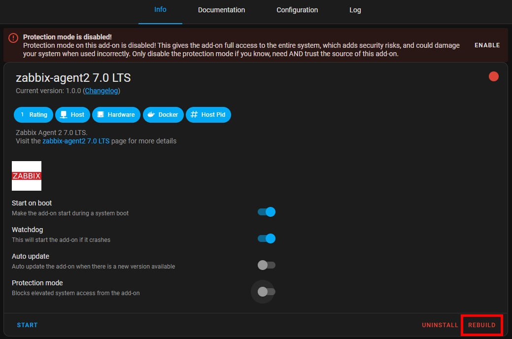

# Home Assistant Add-on: Zabbix Agent 2 7.0 LTS

## Installation

Follow these steps to get the add-on installed on your system:

1. Navigate in your Home Assistant frontend to **Settings** -> **Add-ons** -> **Add-on store**.
2. Add the repository `https://github.com/ChrSchu90/HomeAssistant.Addons.Zabbix`
3. Find the "zabbix-agent2 7.0 LTS" add-on and click it.
4. Click on the "INSTALL" button.

## How to use

1. In the configuration section, set the `Server IP` and `Host Name`.
3. Disable the `Protection mode` inside the Info tab.
4. Start the add-on.
5. Check the add-on log output to see if the agent is running.

## How to update

`Major` updated are separated into different addons, you need to stop the old addon to run the new major version.

`Minor` updated can be applied by rebuilding the addon.
